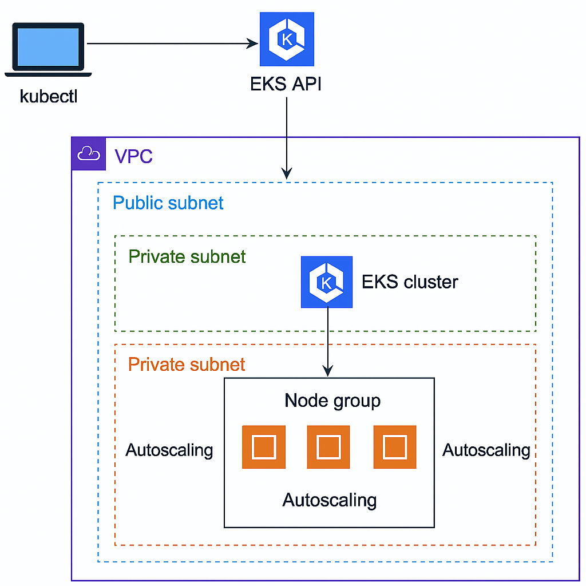

# 🚀 EKS Cluster with Terraform | Secure VPC + Auto-Scaling Node Group

This project provisions a secure, production-ready **Amazon EKS cluster** using **Terraform**, complete with a custom **VPC**, private/public subnets, and an **auto-scaling managed node group**.

## 📌 Overview

- 🛠 **Infrastructure-as-Code (IaC)** with Terraform
- 🌐 **VPC** with 2 Public + 2 Private Subnets across multiple AZs
- 🔒 **EKS Cluster** deployed in **private subnets** for better security
- 📡 **Public API access enabled** for `kubectl` via secure endpoint
- 📈 **Node group auto-scaling** enabled (min: 2 nodes, max: 4)
- ☁️ **Terraform remote backend** for shared state management

---

## 📐 Architecture



---

## 📂 Repository Structure

```bash
.
├── vpc-self.tf                   # VPC with public/private subnets
├── eks-self.tf                   # EKS cluster + managed node group
├── outputs.tf                    # Output variables
├── variables.tf                  # Input variables
├── backend.tf                    # Remote backend config
├── versions.tf                   # Defining the versions of required providers
├── README.md                     # Project documentation
```

### 🚀 Getting Started

#### 1. Clone the Repo

```bash
   git clone https://github.com/taha-khalid/terraform-aws.git
   cd terraform-aws
```

#### 2. Configure Backend & Variables

Update the backend.tf and variables.tf file with your remote backend details and the changes you want to add in variables like changing region etc.

Note: if you are not using or have not configured AWS CLI you would need to define a terraform.tfvars to for authenticating and authorizing terraform to aws access.

#### 3. Initialize Terraform

```bash
 terraform init
```

#### 4. Plan & Apply

```bash
terraform plan
terraform apply
```

### 🔧 kubectl Access

Once the EKS cluster is provisioned:

```bash
aws eks --region <your-region> update-kubeconfig --name <your-cluster-name>
kubectl get nodes
```

### 📈 Auto-Scaling Node Group

The node group is configured to:
Minimum nodes: 2
Maximum nodes: 4
Automatically scales based on pod resource requests and scheduling pressure.

### 🛡 Security Notes

The EKS control plane is deployed in private subnets.
Only API endpoint access is public, restricted by your IP/CIDR.
Use IAM roles and aws-auth config map for fine-grained access control.

### 📘 Prerequisites

- Terraform ≥ 1.12
- AWS CLI
- kubectl
- IAM permissions for EKS/VPC/EC2
